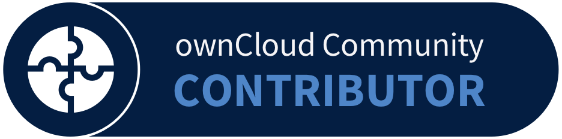

## Hi, I'm Kiran Parajuli 👋 👨‍💻

Software Developer, QA, VueJs, Django

### About me

I'm a software developer with experience as a senior quality assurance engineer. My specialties include Python, PHP, and
NodeJS for backend work and database management. I'm also skilled in VueJs for creating sophisticated web designs.

I take great pride in my attention to detail and commitment to delivering high-quality results. When I'm not coding, I
enjoy playing guitar and listening to music to stay inspired.

I'm always eager to collaborate with others and help bring their visions to life. Let's connect and explore how we can
work together to achieve your goals.

- 🔭 I’m currently working on a website for [Sachchai Kendra Nepal](https://sachchaikendranepal.org.np/)
- 🌱 I’m currently learning [RabbitMQ](https://www.rabbitmq.com/) and [Apache Kafka](https://kafka.apache.org/)
- 👯 I’m looking to collaborate on [WordClub](https://github.com/word-club/)
- 🤔 I’m looking for help with [Markdown Parser](https://github.com/kiranparajuli589/md-parser), a project i built to
  parse markdown to html.
- 💬 Ask me about [VueJs](https://vuejs.org/) and [Django](https://www.djangoproject.com/)
- 📫 How to reach me: [LinkedIn](https://www.linkedin.com/in/kiranparajuli589/)
- 😄 Pronouns: He/His
- ⚡ Fun fact: I spend almost 12 hours listening songs every day.
- 📝 [Resume](https://drive.google.com/file/d/15GZHEjqzKEzD76dokH7witbfDLNBV1ZB/view?usp=sharing)
