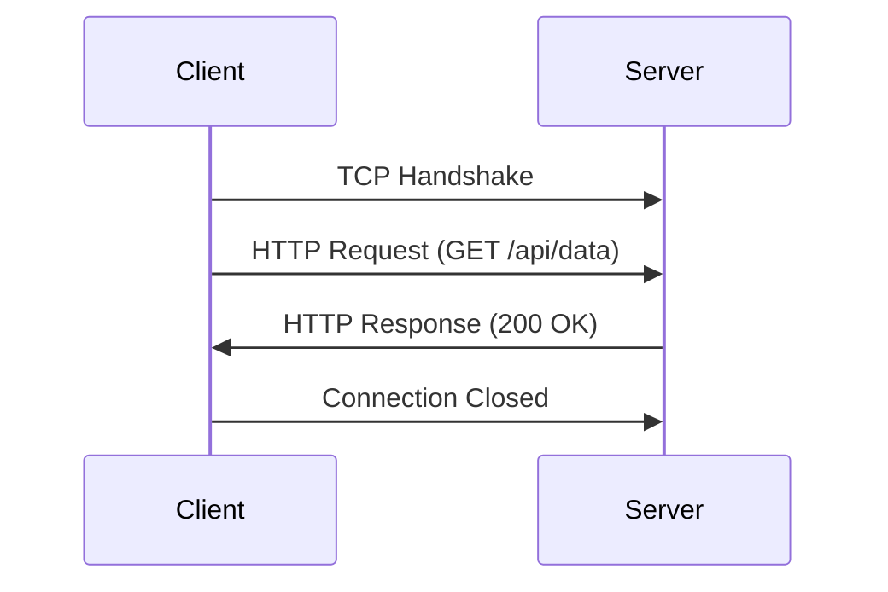
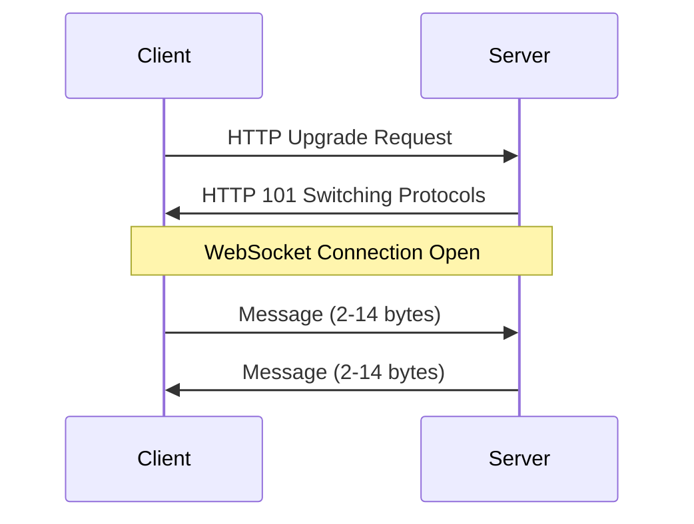

# Blog Images Reference

This directory contains diagrams for the WebSockets blog post. The following images need to be created:

## Required Images

### 1. `http-request-response-flow.png`
**Description:** HTTP Request-Response Flow Diagram
- Shows Client and Server communication
- Steps: TCP Handshake → HTTP Request → HTTP Response → Connection Closed
- Visualize the one-way request-response pattern
- Show connection overhead and termination

### 2. `http-short-polling.png`
**Description:** HTTP Short Polling Pattern
- Client repeatedly sends GET requests at fixed intervals
- Server responds with empty or updated data
- Show the repeated request pattern and wasted bandwidth
- Highlight high latency (waiting between requests)

### 3. `http-long-polling.png`
**Description:** HTTP Long Polling Pattern
- Client sends GET request with keep-alive
- Server holds connection open until data is available
- Show connection being held open, then response
- Highlight that connection still closes and needs to be re-established

### 4. `websocket-connection-flow.png`
**Description:** WebSocket Connection Establishment Flow
- HTTP Upgrade Request (GET /ws with Upgrade headers)
- HTTP 101 Switching Protocols response
- WebSocket connection established (persistent)
- Bidirectional messaging with minimal overhead (2-14 bytes)
- Show connection stays open

### 5. `websocket-communication-pattern.png`
**Description:** WebSocket Bidirectional Communication
- Connection established (persistent)
- Client sends message: { type: "join", room: "1" }
- Server responds: { type: "welcome", ... }
- Client sends: { type: "chat", text: "Hi" }
- Server broadcasts: { type: "chat", user: "Bob", text: "Hello" }
- Show bidirectional arrows and real-time messaging

### 6. `http-vs-websocket-comparison.png`
**Description:** Side-by-side comparison of HTTP vs WebSocket
- Left side: HTTP Request-Response (closed connection)
- Right side: WebSocket Persistent (open bidirectional connection)
- Visual comparison showing key differences
- Highlight connection status and communication direction

## Image Specifications

- **Format:** PNG or SVG (SVG recommended for scalability)
- **Dimensions:** 800-1200px width recommended
- **Style:** Clean, professional diagrams with clear labels
- **Colors:** Use contrasting colors for Client/Server distinction
- **Font:** Readable sans-serif font (Arial, Helvetica, or similar)

## Tools for Creating Diagrams

- **Draw.io / diagrams.net** - Free online diagram tool
- **Excalidraw** - Hand-drawn style diagrams
- **Mermaid** - Code-based diagrams (can export as PNG)
- **Figma** - Professional design tool
- **Lucidchart** - Online diagramming tool

## Mermaid Code Examples (Optional)

If using Mermaid, you can use these as starting points:

### HTTP Request-Response Flow

### WebSocket Connection

